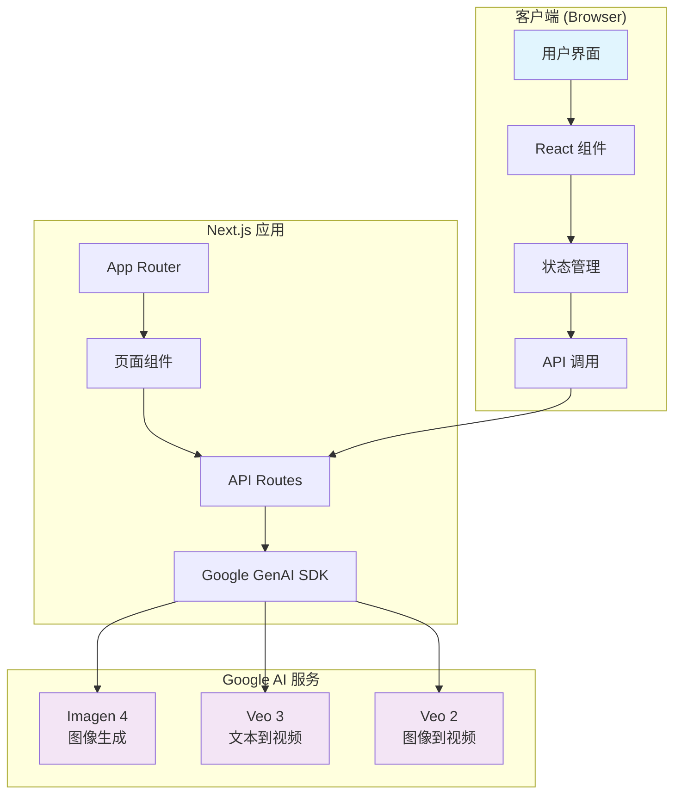
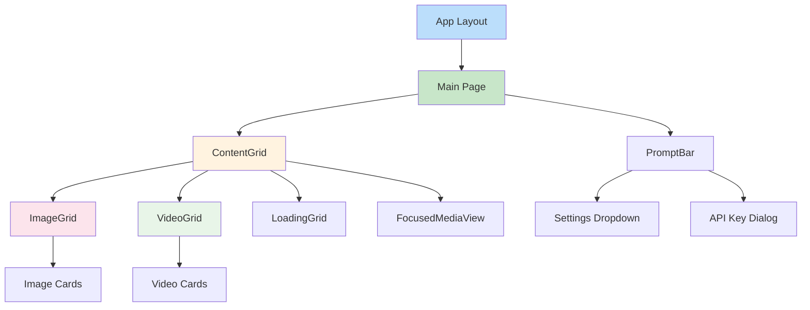
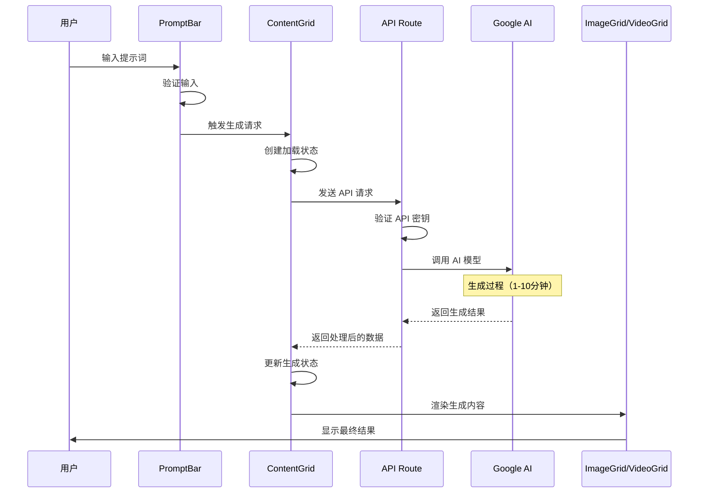
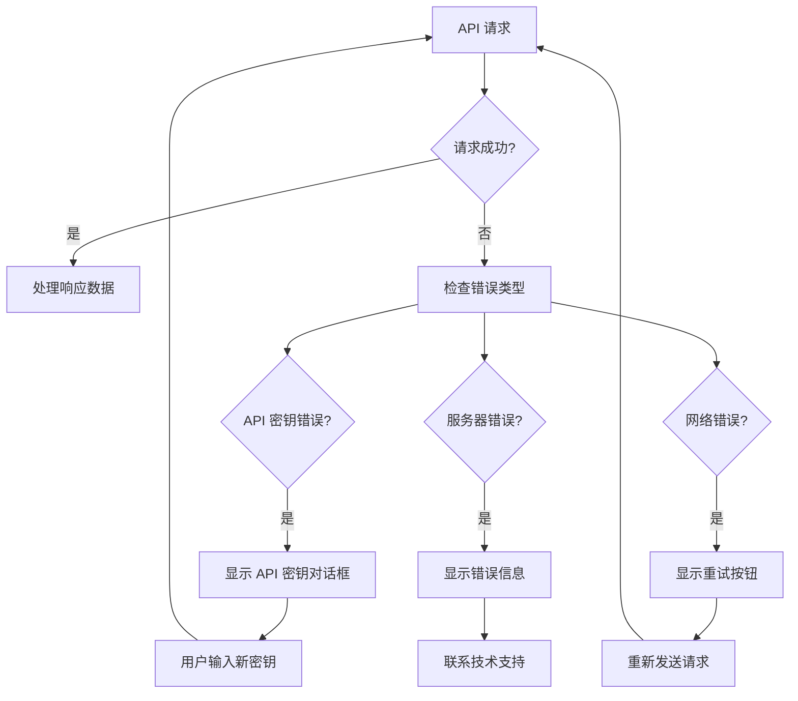

# Openjourney 技术文档

## 目录
- [项目概述](#项目概述)
- [技术栈说明](#技术栈说明)
- [系统架构设计](#系统架构设计)
- [目录结构详细说明](#目录结构详细说明)
- [安装和运行指南](#安装和运行指南)
- [API接口文档](#api接口文档)
- [核心功能模块详解](#核心功能模块详解)
- [数据流程说明](#数据流程说明)
- [配置文件说明](#配置文件说明)
- [开发指南和最佳实践](#开发指南和最佳实践)
- [常见问题和故障排除](#常见问题和故障排除)

## 项目概述

### 什么是 Openjourney？

Openjourney 是一个开源的 MidJourney Web 界面克隆项目，使用 Next.js 15 构建，集成了 Google 的 Gemini SDK 来实现真实的 AI 图像和视频生成功能。

### 主要功能

1. **AI 图像生成**
   - 使用 Imagen 4 模型生成高质量图像
   - 4 图网格布局，模仿 MidJourney 的设计
   - 实时生成过程，带有加载动画

2. **AI 视频生成**
   - Veo 3 文本到视频生成
   - Veo 2 图像到视频转换
   - 2x2 视频网格，悬停时自动播放

3. **交互功能**
   - 下载生成的图像和视频
   - 一键图像到视频转换
   - 悬停动画和专业过渡效果
   - 实时加载状态和骨架动画
   - 胶片条导航，轻松浏览生成内容

### 目标用户

- AI 艺术创作者
- 内容创作者
- 开发者（学习 AI 集成）
- 设计师和创意工作者

## 技术栈说明

### 前端技术栈

| 技术 | 版本 | 用途 | 学习资源 |
|------|------|------|----------|
| **Next.js** | 15.4.2 | React 全栈框架，提供 App Router 和 Turbopack | [Next.js 官方文档](https://nextjs.org/docs) |
| **React** | 19.1.0 | 用户界面库 | [React 官方文档](https://react.dev/) |
| **TypeScript** | ^5 | 类型安全的 JavaScript | [TypeScript 手册](https://www.typescriptlang.org/docs/) |
| **Tailwind CSS** | ^4 | 实用优先的 CSS 框架 | [Tailwind CSS 文档](https://tailwindcss.com/docs) |
| **Framer Motion** | ^12.23.6 | 动画库 | [Framer Motion 文档](https://www.framer.com/motion/) |

### UI 组件库

| 技术 | 用途 | 学习资源 |
|------|------|----------|
| **ShadCN UI** | 基于 Radix UI 的组件库 | [ShadCN UI 文档](https://ui.shadcn.com/) |
| **Radix UI** | 无样式、可访问的 UI 组件 | [Radix UI 文档](https://www.radix-ui.com/) |
| **Lucide React** | 图标库 | [Lucide 图标](https://lucide.dev/) |

### 后端和 AI 集成

| 技术 | 用途 | 学习资源 |
|------|------|----------|
| **Google GenAI SDK** | AI 模型集成（Imagen 4, Veo 2/3） | [Google AI Studio](https://aistudio.google.com/) |
| **Next.js API Routes** | 服务端 API 端点 | [API Routes 文档](https://nextjs.org/docs/app/building-your-application/routing/route-handlers) |

### 开发工具

| 工具 | 用途 |
|------|------|
| **ESLint** | 代码质量检查 |
| **PostCSS** | CSS 处理 |
| **Turbopack** | 快速构建工具 |

## 系统架构设计

### 整体架构图



### 组件架构



## 目录结构详细说明

```
openjourney-app/
├── src/                          # 源代码目录
│   ├── app/                      # Next.js App Router 目录
│   │   ├── api/                  # API 路由目录
│   │   │   ├── generate-images/  # 图像生成 API
│   │   │   │   └── route.ts      # Imagen 4 集成
│   │   │   ├── generate-videos/  # 视频生成 API
│   │   │   │   └── route.ts      # Veo 3 文本到视频
│   │   │   └── image-to-video/   # 图像转视频 API
│   │   │       └── route.ts      # Veo 2 图像到视频
│   │   ├── globals.css           # 全局样式文件
│   │   ├── layout.tsx            # 根布局组件
│   │   └── page.tsx              # 主页面组件
│   ├── components/               # React 组件目录
│   │   ├── ui/                   # ShadCN UI 组件
│   │   │   ├── badge.tsx         # 徽章组件
│   │   │   ├── button.tsx        # 按钮组件
│   │   │   ├── card.tsx          # 卡片组件
│   │   │   ├── dialog.tsx        # 对话框组件
│   │   │   ├── dropdown-menu.tsx # 下拉菜单组件
│   │   │   ├── hover-card.tsx    # 悬停卡片组件
│   │   │   ├── input.tsx         # 输入框组件
│   │   │   ├── label.tsx         # 标签组件
│   │   │   ├── skeleton.tsx      # 骨架屏组件
│   │   │   ├── switch.tsx        # 开关组件
│   │   │   └── tooltip.tsx       # 工具提示组件
│   │   ├── api-key-dialog.tsx    # API 密钥设置对话框
│   │   ├── content-grid.tsx      # 内容网格管理组件
│   │   ├── focused-media-view.tsx # 全屏媒体查看器
│   │   ├── image-grid.tsx        # 图像网格显示组件
│   │   ├── lightbox-modal.tsx    # 灯箱模态框组件
│   │   ├── loading-grid.tsx      # 加载状态网格组件
│   │   ├── prompt-bar.tsx        # 提示词输入栏
│   │   ├── settings-dropdown.tsx # 设置下拉菜单
│   │   └── video-grid.tsx        # 视频网格显示组件
│   └── lib/                      # 工具库目录
│       └── utils.ts              # 通用工具函数
├── public/                       # 静态资源目录
│   ├── openjourney-logo.svg      # 品牌 Logo
│   ├── sample-images/            # 示例图像
│   ├── sample-videos/            # 示例视频
│   └── favicon.png               # 网站图标
├── components.json               # ShadCN UI 配置
├── eslint.config.mjs             # ESLint 配置
├── next.config.js                # Next.js 配置
├── next.config.ts                # Next.js TypeScript 配置
├── package.json                  # 项目依赖和脚本
├── postcss.config.mjs            # PostCSS 配置
├── tsconfig.json                 # TypeScript 配置
└── README.md                     # 项目说明文档
```

### 关键文件说明

#### 核心页面文件
- **`src/app/layout.tsx`**: 应用根布局，设置字体和基础 HTML 结构
- **`src/app/page.tsx`**: 主页面，包含提示词输入栏和内容网格
- **`src/app/globals.css`**: 全局 CSS 样式，包含 Tailwind CSS 导入

#### API 路由文件
- **`src/app/api/generate-images/route.ts`**: 处理图像生成请求，调用 Imagen 4
- **`src/app/api/generate-videos/route.ts`**: 处理文本到视频生成，调用 Veo 3
- **`src/app/api/image-to-video/route.ts`**: 处理图像到视频转换，调用 Veo 2

#### 核心组件文件
- **`src/components/content-grid.tsx`**: 内容管理中心，处理所有生成内容的状态
- **`src/components/prompt-bar.tsx`**: 用户输入界面，包含设置和 Logo
- **`src/components/image-grid.tsx`**: 图像展示网格，支持下载和转视频
- **`src/components/video-grid.tsx`**: 视频展示网格，支持播放控制

## 安装和运行指南

### 环境要求

| 要求 | 最低版本 | 推荐版本 | 说明 |
|------|----------|----------|------|
| **Node.js** | 18.0.0 | 20.0.0+ | JavaScript 运行时 |
| **npm** | 8.0.0 | 10.0.0+ | 包管理器 |
| **操作系统** | - | macOS/Linux/Windows | 跨平台支持 |

### 安装步骤

#### 1. 克隆项目

```bash
# 克隆仓库
git clone https://github.com/your-username/openjourney.git

# 进入项目目录
cd openjourney

# 如果项目在子目录中
cd openjourney-app
```

#### 2. 安装依赖

```bash
# 使用 npm 安装依赖
npm install

# 或使用 yarn
yarn install

# 或使用 pnpm
pnpm install
```

#### 3. 环境配置

创建环境变量文件：

```bash
# 创建环境变量文件
touch .env.local
```

在 `.env.local` 文件中添加以下内容：

```env
# Google AI API 密钥（必需）
GOOGLE_AI_API_KEY=your_google_ai_api_key_here

# 可选：其他环境变量
NODE_ENV=development
```

#### 4. 获取 Google AI API 密钥

1. 访问 [Google AI Studio](https://aistudio.google.com/app/apikey)
2. 登录您的 Google 账户
3. 创建新项目或选择现有项目
4. 点击"Create API Key"生成新的 API 密钥
5. 复制 API 密钥并粘贴到 `.env.local` 文件中

> **注意**: Google AI API 提供免费额度，足够开发和测试使用。

#### 5. 启动开发服务器

```bash
# 启动开发服务器（使用 Turbopack）
npm run dev

# 或使用标准模式
npm run dev -- --no-turbo
```

#### 6. 访问应用

打开浏览器访问 [http://localhost:3000](http://localhost:3000)

### 生产环境部署

#### 构建项目

```bash
# 构建生产版本
npm run build

# 启动生产服务器
npm run start
```

#### Vercel 部署（推荐）

```bash
# 安装 Vercel CLI
npm i -g vercel

# 部署到 Vercel
vercel --prod
```

在 Vercel 控制台中设置环境变量 `GOOGLE_AI_API_KEY`。

#### Docker 部署

```bash
# 构建 Docker 镜像
docker build -t openjourney .

# 运行容器
docker run -p 3000:3000 -e GOOGLE_AI_API_KEY=your_key openjourney
```

## API接口文档

### API 概述

Openjourney 提供三个主要的 API 端点，所有端点都使用 POST 方法，接受 JSON 格式的请求体。

### 通用请求格式

所有 API 端点都支持以下通用参数：

```typescript
interface BaseRequest {
  prompt: string;           // 必需：生成提示词
  apiKey?: string;         // 可选：用户提供的 API 密钥
}
```

### 通用响应格式

```typescript
interface BaseResponse {
  success: boolean;        // 请求是否成功
  error?: string;         // 错误信息（如果有）
  prompt: string;         // 原始提示词
}
```

### 1. 图像生成 API

**端点**: `POST /api/generate-images`

**功能**: 使用 Imagen 4 模型生成 4 张高质量图像

#### 请求参数

```typescript
interface ImageGenerationRequest extends BaseRequest {
  prompt: string;          // 图像生成提示词
  apiKey?: string;        // Google AI API 密钥
}
```

#### 请求示例

```javascript
const response = await fetch('/api/generate-images', {
  method: 'POST',
  headers: {
    'Content-Type': 'application/json',
  },
  body: JSON.stringify({
    prompt: "一只可爱的小猫坐在彩虹上，卡通风格，高质量",
    apiKey: "your_api_key_here" // 可选
  })
});
```

#### 响应格式

```typescript
interface ImageGenerationResponse extends BaseResponse {
  images: Array<{
    url: string;           // 图像 URL
    imageBytes: string;    // Base64 编码的图像数据
  }>;
}
```

#### 响应示例

```json
{
  "success": true,
  "prompt": "一只可爱的小猫坐在彩虹上，卡通风格，高质量",
  "images": [
    {
      "url": "data:image/png;base64,iVBORw0KGgoAAAANSUhEUgAA...",
      "imageBytes": "iVBORw0KGgoAAAANSUhEUgAA..."
    }
    // ... 3 more images
  ]
}
```

### 2. 视频生成 API

**端点**: `POST /api/generate-videos`

**功能**: 使用 Veo 3 模型从文本生成视频

#### 请求参数

```typescript
interface VideoGenerationRequest extends BaseRequest {
  prompt: string;          // 视频生成提示词
  apiKey?: string;        // Google AI API 密钥
}
```

#### 请求示例

```javascript
const response = await fetch('/api/generate-videos', {
  method: 'POST',
  headers: {
    'Content-Type': 'application/json',
  },
  body: JSON.stringify({
    prompt: "一只小猫在花园里追蝴蝶，慢镜头，电影级画质",
    apiKey: "your_api_key_here"
  })
});
```

#### 响应格式

```typescript
interface VideoGenerationResponse extends BaseResponse {
  videos: Array<{
    id: string;            // 视频唯一标识
    url: string;           // 视频 URL
    uri: string;           // 原始 URI
  }>;
}
```

#### 特殊说明

- 视频生成是异步过程，可能需要 5-10 分钟
- API 会轮询检查生成状态，最多等待 10 分钟
- 生成的视频格式为 16:9 宽高比
- 支持人物生成（personGeneration: "allow_all"）

### 3. 图像转视频 API

**端点**: `POST /api/image-to-video`

**功能**: 使用 Veo 2 模型将图像转换为视频

#### 请求参数

```typescript
interface ImageToVideoRequest extends BaseRequest {
  prompt: string;          // 视频生成提示词
  imageBytes: string;      // Base64 编码的图像数据
  apiKey?: string;        // Google AI API 密钥
}
```

#### 请求示例

```javascript
const response = await fetch('/api/image-to-video', {
  method: 'POST',
  headers: {
    'Content-Type': 'application/json',
  },
  body: JSON.stringify({
    prompt: "让这张图片中的小猫动起来，眨眼睛和摆尾巴",
    imageBytes: "iVBORw0KGgoAAAANSUhEUgAA...", // Base64 图像数据
    apiKey: "your_api_key_here"
  })
});
```

#### 响应格式

与视频生成 API 相同，但会生成 2 个视频而不是 1 个。

### 错误处理

#### 常见错误码

| 状态码 | 错误类型 | 说明 | 解决方案 |
|--------|----------|------|----------|
| 400 | Bad Request | 缺少必需参数 | 检查请求参数 |
| 401 | Unauthorized | API 密钥无效或缺失 | 检查 API 密钥 |
| 408 | Request Timeout | 生成超时 | 重试请求 |
| 500 | Internal Server Error | 服务器内部错误 | 联系技术支持 |

#### 错误响应示例

```json
{
  "success": false,
  "error": "No API key provided. Please add your Google AI API key in the settings."
}
```

### API 使用最佳实践

1. **API 密钥管理**
   - 优先使用环境变量中的 API 密钥
   - 支持用户在界面中输入临时 API 密钥
   - 不要在客户端代码中硬编码 API 密钥

2. **错误处理**
   - 始终检查响应中的 `success` 字段
   - 为用户提供友好的错误信息
   - 实现重试机制处理临时错误

3. **性能优化**
   - 视频生成耗时较长，实现适当的加载状态
   - 考虑实现队列系统处理多个并发请求
   - 缓存生成结果避免重复请求

## 核心功能模块详解

### 1. 内容网格管理器 (ContentGrid)

**文件位置**: `src/components/content-grid.tsx`

**主要职责**:
- 管理所有生成内容的状态
- 协调图像和视频生成流程
- 处理用户交互和数据流转

#### 核心状态管理

```typescript
interface Generation {
  id: string;              // 唯一标识
  prompt: string;          // 生成提示词
  timestamp: Date;         // 生成时间
  isLoading: boolean;      // 加载状态
}

interface ImageGeneration extends Generation {
  images: Array<{
    url: string;           // 图像 URL
    imageBytes?: string;   // Base64 数据
    isSample?: boolean;    // 是否为示例图像
  }>;
}

interface VideoGeneration extends Generation {
  videos: string[];        // 视频 URL 数组
  sourceImage?: string;    // 源图像（图像转视频时）
}
```

#### 关键功能

1. **生成内容管理**
   - 维护生成历史记录
   - 支持图像和视频混合显示
   - 实现加载状态管理

2. **用户交互处理**
   - 处理新生成请求
   - 管理图像到视频转换
   - 控制全屏查看模式

3. **状态同步**
   - 与父组件通信
   - 管理 API 密钥对话框
   - 处理错误状态

### 2. 提示词输入栏 (PromptBar)

**文件位置**: `src/components/prompt-bar.tsx`

**主要功能**:
- 用户输入界面
- 生成类型选择（图像/视频）
- 设置和配置入口

#### 核心特性

1. **智能输入**
   - 支持多行文本输入
   - 实时字符计数
   - 输入验证和提示

2. **生成控制**
   - 图像/视频生成切换
   - 生成按钮状态管理
   - 快捷键支持

3. **设置集成**
   - API 密钥管理
   - 用户偏好设置
   - 帮助和文档链接

### 3. 图像网格显示 (ImageGrid)

**文件位置**: `src/components/image-grid.tsx`

**核心功能**:
- 4 图网格布局
- 图像交互控制
- 下载和转换功能

#### 交互功能

1. **图像展示**
   - 响应式网格布局
   - 悬停效果和动画
   - 高质量图像渲染

2. **用户操作**
   - 单击全屏查看
   - 右键下载图像
   - 一键转换为视频

3. **状态指示**
   - 加载状态显示
   - 错误状态处理
   - 操作反馈提示

### 4. 视频网格显示 (VideoGrid)

**文件位置**: `src/components/video-grid.tsx`

**核心功能**:
- 2x2 视频网格布局
- 自动播放控制
- 视频交互管理

#### 视频控制

1. **播放管理**
   - 悬停自动播放
   - 静音播放控制
   - 循环播放设置

2. **用户交互**
   - 点击全屏播放
   - 视频下载功能
   - 播放状态指示

3. **性能优化**
   - 懒加载实现
   - 内存管理
   - 带宽优化

### 5. 全屏媒体查看器 (FocusedMediaView)

**文件位置**: `src/components/focused-media-view.tsx`

**功能特性**:
- 全屏媒体展示
- 胶片条导航
- 媒体信息显示

#### 导航功能

1. **胶片条导航**
   - 缩略图预览
   - 快速切换
   - 当前项目指示

2. **媒体控制**
   - 图像/视频适配显示
   - 缩放和平移控制
   - 播放控制（视频）

3. **信息展示**
   - 生成提示词显示
   - 时间戳信息
   - 媒体元数据

### 6. 加载状态组件 (LoadingGrid)

**文件位置**: `src/components/loading-grid.tsx`

**设计理念**:
- 提供视觉反馈
- 减少用户等待焦虑
- 保持界面一致性

#### 加载动画

1. **骨架屏设计**
   - 模拟真实内容布局
   - 平滑动画效果
   - 响应式适配

2. **进度指示**
   - 生成进度显示
   - 预估时间提示
   - 取消操作支持

## 数据流程说明

### 完整数据流程图



### 详细流程说明

#### 1. 用户输入阶段

1. **输入验证**
   - 检查提示词长度（1-2000 字符）
   - 验证特殊字符和格式
   - 提供输入建议和提示

2. **生成类型选择**
   - 图像生成：直接调用 Imagen 4
   - 视频生成：调用 Veo 3
   - 图像转视频：需要先选择源图像

#### 2. 请求处理阶段

1. **前端处理**
   ```typescript
   const handleGenerate = async (type: "image" | "video", prompt: string) => {
     // 1. 创建加载状态
     const loadingGeneration = createLoadingGeneration(type, prompt);
     setGenerations(prev => [loadingGeneration, ...prev]);

     // 2. 发送 API 请求
     const response = await fetch(`/api/generate-${type}s`, {
       method: 'POST',
       body: JSON.stringify({ prompt, apiKey: userApiKey })
     });

     // 3. 处理响应
     const result = await response.json();
     updateGenerationResult(loadingGeneration.id, result);
   };
   ```

2. **API 路由处理**
   ```typescript
   export async function POST(request: NextRequest) {
     // 1. 解析请求参数
     const { prompt, apiKey } = await request.json();

     // 2. 验证参数和 API 密钥
     if (!prompt || !apiKey) {
       return NextResponse.json({ error: "Missing parameters" });
     }

     // 3. 调用 Google AI SDK
     const ai = new GoogleGenAI({ apiKey });
     const response = await ai.models.generateImages({
       model: 'imagen-4.0-generate-preview-06-06',
       prompt,
       config: { numberOfImages: 4 }
     });

     // 4. 处理和返回结果
     return NextResponse.json({ success: true, images: response.images });
   }
   ```

#### 3. 结果处理阶段

1. **数据转换**
   - 将 API 响应转换为组件可用格式
   - 处理 Base64 图像数据
   - 生成唯一标识符和时间戳

2. **状态更新**
   - 移除加载状态
   - 添加生成结果到历史记录
   - 触发 UI 重新渲染

3. **用户反馈**
   - 显示生成成功提示
   - 提供下载和分享选项
   - 支持进一步操作（如图像转视频）

### 错误处理流程



### 性能优化策略

1. **请求优化**
   - 防抖处理避免重复请求
   - 请求队列管理并发限制
   - 缓存机制减少重复生成

2. **渲染优化**
   - 虚拟滚动处理大量内容
   - 图像懒加载节省带宽
   - 组件级别的状态管理

3. **内存管理**
   - 及时清理不需要的生成结果
   - 图像和视频资源的生命周期管理
   - 避免内存泄漏的最佳实践

## 配置文件说明

### 1. Next.js 配置 (next.config.js)

**文件位置**: `next.config.js`

```javascript
/** @type {import('next').NextConfig} */
const nextConfig = {
  images: {
    remotePatterns: [
      {
        protocol: 'https',
        hostname: 'picsum.photos',  // 允许的外部图像域名
        port: '',
        pathname: '/**',
      },
    ],
  },
};

module.exports = nextConfig;
```

**配置说明**:
- **images.remotePatterns**: 配置允许的外部图像源
- 用于 Next.js Image 组件的安全策略
- 可以添加更多域名以支持其他图像源

### 2. TypeScript 配置 (tsconfig.json)

**文件位置**: `tsconfig.json`

```json
{
  "compilerOptions": {
    "target": "ES2017",              // 编译目标版本
    "lib": ["dom", "dom.iterable", "esnext"],  // 包含的库
    "allowJs": true,                 // 允许 JavaScript 文件
    "skipLibCheck": true,            // 跳过库文件类型检查
    "strict": true,                  // 启用严格模式
    "noEmit": true,                  // 不生成输出文件
    "esModuleInterop": true,         // ES 模块互操作
    "module": "esnext",              // 模块系统
    "moduleResolution": "bundler",   // 模块解析策略
    "resolveJsonModule": true,       // 允许导入 JSON
    "isolatedModules": true,         // 隔离模块
    "jsx": "preserve",               // JSX 处理方式
    "incremental": true,             // 增量编译
    "plugins": [{ "name": "next" }], // Next.js 插件
    "paths": {
      "@/*": ["./src/*"]             // 路径别名配置
    }
  },
  "include": ["next-env.d.ts", "**/*.ts", "**/*.tsx", ".next/types/**/*.ts"],
  "exclude": ["node_modules"]
}
```

**关键配置解释**:
- **paths**: 设置 `@/` 别名指向 `src/` 目录
- **strict**: 启用 TypeScript 严格模式，提高代码质量
- **jsx**: 保留 JSX 语法，由 Next.js 处理

### 3. Tailwind CSS 配置

**文件位置**: `postcss.config.mjs`

```javascript
/** @type {import('postcss-load-config').Config} */
const config = {
  plugins: {
    '@tailwindcss/postcss': {},  // Tailwind CSS v4 PostCSS 插件
  },
};

export default config;
```

**Tailwind CSS v4 特性**:
- 使用新的 PostCSS 插件架构
- 更快的构建速度
- 改进的 CSS 生成算法

### 4. ESLint 配置 (eslint.config.mjs)

**文件位置**: `eslint.config.mjs`

```javascript
import { dirname } from "path";
import { fileURLToPath } from "url";
import { FlatCompat } from "@eslint/eslintrc";

const __filename = fileURLToPath(import.meta.url);
const __dirname = dirname(__filename);

const compat = new FlatCompat({
  baseDirectory: __dirname,
});

const eslintConfig = [
  ...compat.extends("next/core-web-vitals"),  // Next.js 推荐规则
];

export default eslintConfig;
```

**配置特点**:
- 使用 ESLint 9 的扁平配置格式
- 继承 Next.js 核心 Web Vitals 规则
- 确保代码质量和性能最佳实践

### 5. ShadCN UI 配置 (components.json)

**文件位置**: `components.json`

```json
{
  "$schema": "https://ui.shadcn.com/schema.json",
  "style": "default",              // 组件样式风格
  "rsc": true,                     // React Server Components 支持
  "tsx": true,                     // TypeScript 支持
  "tailwind": {
    "config": "tailwind.config.ts", // Tailwind 配置文件
    "css": "src/app/globals.css",   // 全局 CSS 文件
    "baseColor": "slate",           // 基础颜色主题
    "cssVariables": true            // 使用 CSS 变量
  },
  "aliases": {
    "components": "@/components",    // 组件别名
    "utils": "@/lib/utils"          // 工具函数别名
  }
}
```

**配置说明**:
- **style**: 使用默认的组件样式
- **rsc**: 启用 React Server Components 支持
- **cssVariables**: 使用 CSS 变量实现主题切换

### 6. 包管理配置 (package.json)

**关键脚本说明**:

```json
{
  "scripts": {
    "dev": "next dev --turbopack",   // 开发服务器（使用 Turbopack）
    "build": "next build",           // 构建生产版本
    "start": "next start",           // 启动生产服务器
    "lint": "next lint"              // 代码检查
  }
}
```

**依赖分类**:

1. **核心框架**
   - `next`: Next.js 框架
   - `react`: React 库
   - `typescript`: TypeScript 支持

2. **UI 组件**
   - `@radix-ui/*`: 无障碍 UI 组件
   - `lucide-react`: 图标库
   - `framer-motion`: 动画库

3. **样式工具**
   - `tailwindcss`: CSS 框架
   - `class-variance-authority`: 样式变体管理
   - `tailwind-merge`: 样式合并工具

4. **AI 集成**
   - `@google/genai`: Google AI SDK

### 环境变量配置

**文件位置**: `.env.local` (需要创建)

```env
# Google AI API 密钥（必需）
GOOGLE_AI_API_KEY=your_google_ai_api_key_here

# 开发环境配置
NODE_ENV=development

# 可选：自定义配置
NEXT_PUBLIC_APP_NAME=Openjourney
NEXT_PUBLIC_APP_VERSION=0.1.0

# 可选：分析和监控
NEXT_PUBLIC_ANALYTICS_ID=your_analytics_id
```

**环境变量说明**:
- **GOOGLE_AI_API_KEY**: 必需，用于 AI 模型调用
- **NEXT_PUBLIC_***: 客户端可访问的环境变量
- **NODE_ENV**: 自动设置，区分开发和生产环境

## 开发指南和最佳实践

### 1. 代码组织原则

#### 文件命名规范

```
组件文件：kebab-case.tsx        (例: prompt-bar.tsx)
工具文件：kebab-case.ts         (例: utils.ts)
类型文件：kebab-case.types.ts   (例: api.types.ts)
常量文件：UPPER_CASE.ts         (例: CONSTANTS.ts)
```

#### 目录结构规范

```
src/
├── app/                    # Next.js App Router
│   ├── api/               # API 路由
│   ├── (pages)/           # 页面分组
│   └── globals.css        # 全局样式
├── components/            # React 组件
│   ├── ui/               # 基础 UI 组件
│   ├── features/         # 功能组件
│   └── layout/           # 布局组件
├── lib/                  # 工具库
│   ├── utils.ts          # 通用工具
│   ├── api.ts            # API 客户端
│   └── constants.ts      # 常量定义
├── types/                # TypeScript 类型定义
└── hooks/                # 自定义 React Hooks
```

### 2. 组件开发最佳实践

#### React 组件模式

```typescript
// 1. 导入顺序
import React from 'react';                    // React 相关
import { useState, useEffect } from 'react';  // React Hooks
import { motion } from 'framer-motion';       // 第三方库
import { Button } from '@/components/ui';     // 内部组件
import { cn } from '@/lib/utils';             // 工具函数

// 2. 类型定义
interface ComponentProps {
  title: string;
  onAction?: () => void;
  className?: string;
  children?: React.ReactNode;
}

// 3. 组件实现
export function Component({
  title,
  onAction,
  className,
  children
}: ComponentProps) {
  // 状态管理
  const [isLoading, setIsLoading] = useState(false);

  // 副作用
  useEffect(() => {
    // 组件逻辑
  }, []);

  // 事件处理
  const handleAction = () => {
    setIsLoading(true);
    onAction?.();
    setIsLoading(false);
  };

  // 渲染
  return (
    <div className={cn("base-styles", className)}>
      <h2>{title}</h2>
      {children}
      <Button onClick={handleAction} disabled={isLoading}>
        {isLoading ? "Loading..." : "Action"}
      </Button>
    </div>
  );
}
```

#### 状态管理模式

```typescript
// 使用 useState 进行本地状态管理
const [state, setState] = useState<StateType>(initialState);

// 复杂状态使用 useReducer
const [state, dispatch] = useReducer(reducer, initialState);

// 状态提升到父组件
interface ParentProps {
  onStateChange: (newState: StateType) => void;
}
```

### 3. API 开发最佳实践

#### API 路由结构

```typescript
// src/app/api/example/route.ts
import { NextRequest, NextResponse } from 'next/server';

export async function POST(request: NextRequest) {
  try {
    // 1. 参数验证
    const body = await request.json();
    const { param1, param2 } = body;

    if (!param1 || !param2) {
      return NextResponse.json(
        { error: "Missing required parameters" },
        { status: 400 }
      );
    }

    // 2. 业务逻辑
    const result = await processRequest(param1, param2);

    // 3. 返回结果
    return NextResponse.json({
      success: true,
      data: result
    });

  } catch (error) {
    console.error('API Error:', error);
    return NextResponse.json(
      { error: "Internal server error" },
      { status: 500 }
    );
  }
}
```

#### 错误处理模式

```typescript
// 统一错误处理函数
export function handleApiError(error: unknown) {
  if (error instanceof Error) {
    console.error('API Error:', error.message);
    return NextResponse.json(
      { error: error.message },
      { status: 500 }
    );
  }

  return NextResponse.json(
    { error: "Unknown error occurred" },
    { status: 500 }
  );
}
```

### 4. 样式开发指南

#### Tailwind CSS 最佳实践

```typescript
// 1. 使用 cn 函数合并样式
import { cn } from '@/lib/utils';

const buttonStyles = cn(
  "base-button-styles",
  variant === "primary" && "primary-styles",
  size === "large" && "large-styles",
  className
);

// 2. 创建样式变体
import { cva } from "class-variance-authority";

const buttonVariants = cva(
  "inline-flex items-center justify-center rounded-md font-medium",
  {
    variants: {
      variant: {
        default: "bg-primary text-primary-foreground",
        destructive: "bg-destructive text-destructive-foreground",
      },
      size: {
        default: "h-10 px-4 py-2",
        sm: "h-9 rounded-md px-3",
        lg: "h-11 rounded-md px-8",
      },
    },
    defaultVariants: {
      variant: "default",
      size: "default",
    },
  }
);
```

#### 响应式设计

```css
/* 移动优先的响应式设计 */
.container {
  @apply w-full px-4;          /* 移动端 */
  @apply sm:px-6;              /* 小屏幕 */
  @apply md:px-8;              /* 中等屏幕 */
  @apply lg:max-w-7xl lg:mx-auto; /* 大屏幕 */
}
```

### 5. 性能优化指南

#### 组件优化

```typescript
// 1. 使用 React.memo 避免不必要的重渲染
export const OptimizedComponent = React.memo(function Component(props) {
  return <div>{props.content}</div>;
});

// 2. 使用 useMemo 缓存计算结果
const expensiveValue = useMemo(() => {
  return computeExpensiveValue(data);
}, [data]);

// 3. 使用 useCallback 缓存函数
const handleClick = useCallback(() => {
  onAction(id);
}, [onAction, id]);
```

#### 图像和媒体优化

```typescript
// 1. 使用 Next.js Image 组件
import Image from 'next/image';

<Image
  src={imageUrl}
  alt="Description"
  width={500}
  height={300}
  priority={isAboveFold}
  placeholder="blur"
  blurDataURL="data:image/jpeg;base64,..."
/>

// 2. 懒加载视频
<video
  loading="lazy"
  preload="metadata"
  muted
  loop
  playsInline
>
  <source src={videoUrl} type="video/mp4" />
</video>
```

### 6. 测试策略

#### 单元测试示例

```typescript
// __tests__/components/Button.test.tsx
import { render, screen, fireEvent } from '@testing-library/react';
import { Button } from '@/components/ui/button';

describe('Button Component', () => {
  it('renders correctly', () => {
    render(<Button>Click me</Button>);
    expect(screen.getByRole('button')).toBeInTheDocument();
  });

  it('handles click events', () => {
    const handleClick = jest.fn();
    render(<Button onClick={handleClick}>Click me</Button>);

    fireEvent.click(screen.getByRole('button'));
    expect(handleClick).toHaveBeenCalledTimes(1);
  });
});
```

#### API 测试

```typescript
// __tests__/api/generate-images.test.ts
import { POST } from '@/app/api/generate-images/route';
import { NextRequest } from 'next/server';

describe('/api/generate-images', () => {
  it('generates images successfully', async () => {
    const request = new NextRequest('http://localhost:3000/api/generate-images', {
      method: 'POST',
      body: JSON.stringify({
        prompt: 'A beautiful sunset',
        apiKey: 'test-key'
      })
    });

    const response = await POST(request);
    const data = await response.json();

    expect(response.status).toBe(200);
    expect(data.success).toBe(true);
    expect(data.images).toHaveLength(4);
  });
});
```

### 7. 部署和监控

#### 生产环境检查清单

- [ ] 环境变量正确配置
- [ ] API 密钥安全存储
- [ ] 构建无错误和警告
- [ ] 性能指标达标
- [ ] 安全扫描通过
- [ ] 错误监控配置
- [ ] 日志记录完善

#### 监控和分析

```typescript
// 性能监控
export function reportWebVitals(metric: any) {
  if (metric.label === 'web-vital') {
    console.log(metric); // 发送到分析服务
  }
}

// 错误边界
class ErrorBoundary extends React.Component {
  componentDidCatch(error: Error, errorInfo: React.ErrorInfo) {
    // 发送错误报告到监控服务
    console.error('Error caught by boundary:', error, errorInfo);
  }

  render() {
    if (this.state.hasError) {
      return <ErrorFallback />;
    }
    return this.props.children;
  }
}

## 常见问题和故障排除

### 1. 安装和配置问题

#### Q: npm install 失败，出现依赖冲突

**问题描述**: 安装依赖时出现 peer dependency 警告或冲突

**解决方案**:
```bash
# 1. 清理缓存
npm cache clean --force

# 2. 删除 node_modules 和 package-lock.json
rm -rf node_modules package-lock.json

# 3. 重新安装
npm install

# 4. 如果仍有问题，使用 --legacy-peer-deps
npm install --legacy-peer-deps
```

#### Q: TypeScript 编译错误

**问题描述**: 出现类型错误或模块找不到

**解决方案**:
```bash
# 1. 检查 TypeScript 版本
npx tsc --version

# 2. 重新生成类型文件
rm -rf .next
npm run dev

# 3. 检查 tsconfig.json 配置
# 确保 paths 配置正确
```

#### Q: Tailwind CSS 样式不生效

**问题描述**: 样式类不起作用或样式丢失

**解决方案**:
```bash
# 1. 检查 PostCSS 配置
cat postcss.config.mjs

# 2. 重新构建
npm run build

# 3. 检查 globals.css 中的 Tailwind 导入
# @tailwind base;
# @tailwind components;
# @tailwind utilities;
```

### 2. API 和集成问题

#### Q: Google AI API 密钥无效

**错误信息**: `"No API key provided"` 或 `"Invalid API key"`

**解决步骤**:
1. **验证 API 密钥**
   ```bash
   # 检查环境变量
   echo $GOOGLE_AI_API_KEY
   ```

2. **重新获取 API 密钥**
   - 访问 [Google AI Studio](https://aistudio.google.com/app/apikey)
   - 确认项目和计费设置
   - 生成新的 API 密钥

3. **检查配置文件**
   ```env
   # .env.local
   GOOGLE_AI_API_KEY=your_actual_api_key_here
   ```

4. **重启开发服务器**
   ```bash
   npm run dev
   ```

#### Q: 图像生成失败或超时

**问题分析**:
- API 配额用完
- 网络连接问题
- 提示词包含敏感内容

**解决方案**:
```typescript
// 1. 添加重试机制
const generateWithRetry = async (prompt: string, maxRetries = 3) => {
  for (let i = 0; i < maxRetries; i++) {
    try {
      const response = await fetch('/api/generate-images', {
        method: 'POST',
        body: JSON.stringify({ prompt })
      });

      if (response.ok) {
        return await response.json();
      }

      if (i === maxRetries - 1) throw new Error('Max retries reached');

      // 等待后重试
      await new Promise(resolve => setTimeout(resolve, 1000 * (i + 1)));

    } catch (error) {
      if (i === maxRetries - 1) throw error;
    }
  }
};

// 2. 检查提示词内容
const validatePrompt = (prompt: string) => {
  const sensitiveWords = ['violence', 'explicit', 'harmful'];
  return !sensitiveWords.some(word =>
    prompt.toLowerCase().includes(word)
  );
};
```

#### Q: 视频生成时间过长

**问题描述**: 视频生成超过 10 分钟仍未完成

**优化策略**:
1. **调整超时设置**
   ```typescript
   // 在 API 路由中增加超时时间
   const maxAttempts = 120; // 20 分钟
   const waitTime = 10000;  // 10 秒间隔
   ```

2. **实现队列系统**
   ```typescript
   // 使用 Redis 或数据库实现任务队列
   interface VideoJob {
     id: string;
     prompt: string;
     status: 'pending' | 'processing' | 'completed' | 'failed';
     createdAt: Date;
   }
   ```

3. **添加进度指示**
   ```typescript
   // 显示预估时间
   const estimatedTime = getEstimatedTime(prompt);
   setLoadingMessage(`预计需要 ${estimatedTime} 分钟...`);
   ```

### 3. 性能问题

#### Q: 页面加载缓慢

**性能分析工具**:
```bash
# 1. 使用 Next.js 分析工具
npm run build
npm run analyze

# 2. 检查包大小
npx @next/bundle-analyzer
```

**优化措施**:
```typescript
// 1. 代码分割
const LazyComponent = dynamic(() => import('./HeavyComponent'), {
  loading: () => <Skeleton />,
  ssr: false
});

// 2. 图像优化
<Image
  src={imageUrl}
  alt="Description"
  width={500}
  height={300}
  priority={false}
  loading="lazy"
/>

// 3. 预加载关键资源
<link rel="preload" href="/api/generate-images" as="fetch" />
```

#### Q: 内存使用过高

**问题排查**:
```typescript
// 1. 监控内存使用
const checkMemoryUsage = () => {
  if (typeof window !== 'undefined' && 'memory' in performance) {
    console.log('Memory usage:', performance.memory);
  }
};

// 2. 清理资源
useEffect(() => {
  return () => {
    // 清理定时器
    clearInterval(intervalId);

    // 清理事件监听器
    window.removeEventListener('resize', handleResize);

    // 清理对象 URL
    if (objectUrl) {
      URL.revokeObjectURL(objectUrl);
    }
  };
}, []);
```

### 4. 部署问题

#### Q: Vercel 部署失败

**常见错误和解决方案**:

1. **构建错误**
   ```bash
   # 本地测试构建
   npm run build

   # 检查构建日志
   cat .next/build-manifest.json
   ```

2. **环境变量未设置**
   - 在 Vercel 控制台设置环境变量
   - 确保变量名称完全匹配

3. **函数超时**
   ```javascript
   // vercel.json
   {
     "functions": {
       "src/app/api/generate-videos/route.ts": {
         "maxDuration": 300
       }
     }
   }
   ```

#### Q: 生产环境 API 调用失败

**调试步骤**:
```typescript
// 1. 添加详细日志
console.log('Environment:', process.env.NODE_ENV);
console.log('API Key exists:', !!process.env.GOOGLE_AI_API_KEY);

// 2. 检查 CORS 设置
export async function POST(request: NextRequest) {
  const response = NextResponse.json(data);
  response.headers.set('Access-Control-Allow-Origin', '*');
  return response;
}

// 3. 错误监控
try {
  // API 调用
} catch (error) {
  // 发送到错误监控服务
  console.error('Production API Error:', {
    error: error.message,
    stack: error.stack,
    timestamp: new Date().toISOString()
  });
}
```

### 5. 用户体验问题

#### Q: 移动端显示异常

**响应式设计检查**:
```css
/* 确保移动端适配 */
@media (max-width: 640px) {
  .grid {
    grid-template-columns: 1fr;
    gap: 1rem;
  }

  .text-size {
    font-size: 0.875rem;
  }
}
```

**触摸交互优化**:
```typescript
// 添加触摸事件支持
const handleTouchStart = (e: TouchEvent) => {
  // 处理触摸开始
};

const handleTouchEnd = (e: TouchEvent) => {
  // 处理触摸结束
};
```

#### Q: 无障碍访问问题

**无障碍改进**:
```typescript
// 1. 添加 ARIA 标签
<button
  aria-label="生成图像"
  aria-describedby="generate-help"
  disabled={isLoading}
>
  {isLoading ? '生成中...' : '生成'}
</button>

// 2. 键盘导航支持
const handleKeyDown = (e: KeyboardEvent) => {
  if (e.key === 'Enter' || e.key === ' ') {
    handleGenerate();
  }
};

// 3. 焦点管理
useEffect(() => {
  if (isModalOpen) {
    modalRef.current?.focus();
  }
}, [isModalOpen]);
```

### 6. 开发工具问题

#### Q: ESLint 报错过多

**配置优化**:
```javascript
// eslint.config.mjs
const eslintConfig = [
  ...compat.extends("next/core-web-vitals"),
  {
    rules: {
      // 自定义规则
      '@typescript-eslint/no-unused-vars': 'warn',
      'react-hooks/exhaustive-deps': 'warn',
    }
  }
];
```

#### Q: 热重载不工作

**解决方案**:
```bash
# 1. 检查文件监听
echo fs.inotify.max_user_watches=524288 | sudo tee -a /etc/sysctl.conf

# 2. 重启开发服务器
npm run dev -- --port 3001

# 3. 清理缓存
rm -rf .next
```

### 7. 获取帮助和支持

#### 官方资源

- **Next.js 文档**: [https://nextjs.org/docs](https://nextjs.org/docs)
- **React 文档**: [https://react.dev/](https://react.dev/)
- **Tailwind CSS 文档**: [https://tailwindcss.com/docs](https://tailwindcss.com/docs)
- **Google AI 文档**: [https://ai.google.dev/docs](https://ai.google.dev/docs)

#### 社区支持

- **GitHub Issues**: 在项目仓库提交问题
- **Discord 社区**: 加入相关技术社区
- **Stack Overflow**: 搜索和提问技术问题

#### 调试技巧

```typescript
// 1. 开发环境调试
if (process.env.NODE_ENV === 'development') {
  console.log('Debug info:', debugData);
}

// 2. 网络请求调试
const debugFetch = async (url: string, options: RequestInit) => {
  console.log('Request:', { url, options });
  const response = await fetch(url, options);
  console.log('Response:', response.status, response.statusText);
  return response;
};

// 3. 状态调试
useEffect(() => {
  console.log('State changed:', { state, timestamp: Date.now() });
}, [state]);
```

---

## 总结

这份技术文档涵盖了 Openjourney 项目的所有核心方面，从基础安装到高级开发实践。作为新手开发者，建议按以下顺序学习：

1. **理解项目概述和技术栈**
2. **完成安装和基础配置**
3. **熟悉目录结构和核心组件**
4. **学习 API 接口和数据流程**
5. **掌握开发最佳实践**
6. **解决常见问题和故障**

记住，学习是一个渐进的过程。遇到问题时，先查阅文档，然后寻求社区帮助。随着经验的积累，你将能够更好地理解和扩展这个项目。

**祝你开发愉快！** 🚀
```
